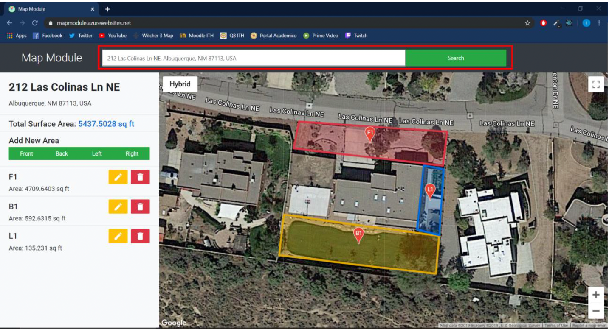

## Map Module
This is the code we delivered to a client which business revolves around gardening services. It solves the problem of doing quick price estimations for a gardening business by creating an area(polygon) in the customer's address.

The code in mapmodule(front end) was written using old react(16.11.0) and the one in WebAPI(API) was written in .net core 3.

It was a team project built by:
[Ivan Sodari](https://www.linkedin.com/in/ivan-sodari/) (frontend dev)
[Oscar Encinas](https://www.linkedin.com/in/oscar-ignacio-encinas-verduzco-849a861aa/) (backend dev)
[German Soto](https://www.linkedin.com/in/german-soto-bab8ab226/) (frontend dev)
